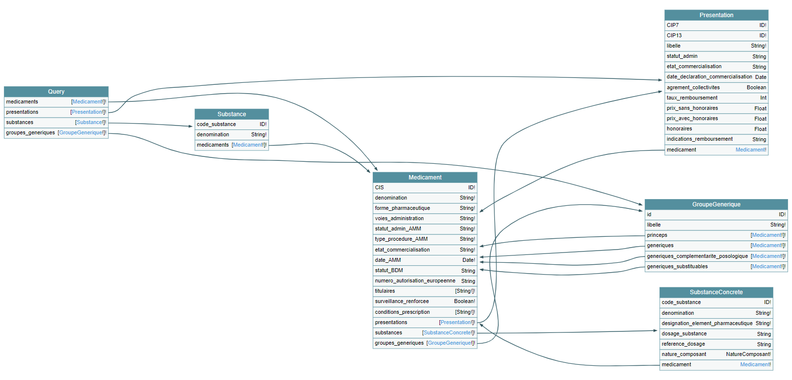

# API GraphQL pour la Base de Données Publique des Médicaments



La [Base de Données Publique des Médicaments](http://base-donnees-publique.medicaments.gouv.fr), mise à disposition par l'ANSM, la HAS et l'UNCAM, est [téléchargeable sous la forme de multiples fichiers](http://base-donnees-publique.medicaments.gouv.fr/telechargement.php) contenant des données tabulaires délimitées par des tabulations. Ces fichiers présentent deux inconvénients :

- ils sont reliés entre eux de façon complexe, avec des clés qui ne sont pas toujours uniques au sein d'un même fichier ;
- les données sont parfois mal formatées, difficilement *parsables* sans pré-traitement.

Cette API a pour objectif de résoudre ces problèmes en **typant** les données de la base et en permettant d'extraire toutes les données nécessaires, et seulement ces données, en un **minimum de requêtes**, grâce au langage de requête [GraphQL](https://graphql.org/learn).

## Utilisation

### Localement

Démarrer le serveur :

```bash
npm install
node src/server.js
```

Une fois le serveur démarré, les requêtes (HTTP POST) peuvent être envoyées à [`localhost:4000/graphql`](http://localhost:4000/graphql) (accéder à cette adresse depuis un navigateur affichera une interface graphique).

```bash
curl http://localhost:4000/graphql -H "Content-Type: application/graphql" -d "query { medicaments(CIS: [62204255]) { denomination } }"

# Si la requête GraphQL est contenue dans le fichier "requete.graphql" :
curl http://localhost:4000/graphql -H "Content-Type: application/graphql" -d @requete.graphql
```

### En ligne

L'API est hébergée en ligne : <https://api-bdpm-graphql.axel-op.fr/graphql>.

## Guide

Le schéma complet est disponible dans [`schema.graphql`](./schema.graphql).

### Requête par code

Demander un médicament à partir de son CIS (Code Identifiant de Spécialité), sa dénomination, les substances qu'il contient avec leur code et leur dénomination :

```graphql
query {
  medicaments(CIS: ["68572075"]) {
    denomination
    substances {
      code_substance
      denominations
    }
  }
}
```

Réponse :

```json
{
  "data": {
    "medicaments": [
      {
        "denomination": "FAMOTIDINE MYLAN 20 mg, comprimé pelliculé",
        "substances": [
          {
            "code_substance": "4034",
            "denominations": [
              "FAMOTIDINE"
            ]
          }
        ]
      }
    ]
  }
}
```

Demander une substance à partir de son code, sa dénomination, et tous les médicaments qui la contiennent avec leur dénomination :

```graphql
query {
  substances(codes_substances: ["4034"]) {
    denominations
    medicaments {
      denomination
    }
  }
}
```

Réponse :

```json
{
  "data": {
    "substances": [
      {
        "denominations": [
          "FAMOTIDINE"
        ],
        "medicaments": [
          {
            "denomination": "FAMOTIDINE EG 20 mg, comprimé pelliculé"
          },
          {
            "denomination": "FAMOTIDINE MYLAN 40 mg, comprimé pelliculé"
          },
          {
            "denomination": "FAMOTIDINE EG 40 mg, comprimé pelliculé"
          },
          {
            "denomination": "FAMOTIDINE MYLAN 20 mg, comprimé pelliculé"
          }
        ]
      }
    ]
  }
}
```

Demander un groupe générique à partir de son identifiant, et son ou ses médicament(s) princeps, avec pour chaque médicament leur dénomination et celle de leurs substances :

```graphql
query {
  groupes_generiques(ids: ["101"]) {
    libelle
    princeps {
      denomination
      substances {
        denominations
      }
    }
  }
}
```

Réponse :

```json
{
  "data": {
    "groupes_generiques": [
      {
        "libelle": "CAPTOPRIL 50 mg + HYDROCHLOROTHIAZIDE 25 mg - ECAZIDE, comprimé sécable - CAPTEA, comprimé sécable.",
        "princeps": [
          {
            "denomination": "ECAZIDE, comprimé sécable",
            "substances": [
              {
                "denominations": [
                  "HYDROCHLOROTHIAZIDE"
                ]
              },
              {
                "denominations": [
                  "CAPTOPRIL"
                ]
              }
            ]
          },
          {
            "denomination": "CAPTEA, comprimé sécable",
            "substances": [
              {
                "denominations": [
                  "HYDROCHLOROTHIAZIDE"
                ]
              },
              {
                "denominations": [
                  "CAPTOPRIL"
                ]
              }
            ]
          }
        ]
      }
    ]
  }
}
```

### Requête par produit

Demander tous les médicaments avec leur dénomination, et toutes les substances avec leur dénomination (l'argument `limit` permet de limiter le nombre de résultats) :

```graphql
query {
  medicaments(limit: 3) {
    denomination
  }
  
  substances(limit: 3) {
    denominations
  }
}
```

Réponse :

```json
{
  "data": {
    "medicaments": [
      {
        "denomination": "ANASTROZOLE ACCORD 1 mg, comprimé pelliculé"
      },
      {
        "denomination": "RANITIDINE BIOGARAN 150 mg, comprimé effervescent"
      },
      {
        "denomination": "ACTAEA RACEMOSA FERRIER, degré de dilution compris entre 2CH et 30CH ou entre 4DH et 60DH"
      }
    ],
    "substances": [
      {
        "denominations": [
          "CHLORHYDRATE DE LOPÉRAMIDE",
          "LOPÉRAMIDE (CHLORHYDRATE DE)"
        ]
      },
      {
        "denominations": [
          "SPLENINE POUR PRÉPARATIONS HOMÉOPATHIQUES"
        ]
      },
      {
        "denominations": [
          "ACÉTAZOLAMIDE"
        ]
      }
    ]
  }
}
```

### Requête paginée

Pour une même requête, les éléments sont toujours renvoyés dans le même ordre.

Il est possible d'effectuer une requête paginée avec les arguments `from` et `limit` :

- `from` est l'index du premier élément à renvoyer (à partir de 0),
- `limit` est le nombre maximum d'éléments à renvoyer.

Exemple :

```graphql
query {
  page_1:
  presentations(limit: 3, from: 0) {
    ...champs
  }

  page_2:
  presentations(limit: 3, from: 3) {
    ...champs
  }

  pages_1_et_2:
  presentations(limit: 6) {
    ...champs
  }
}

fragment champs on Presentation {
  CIP7
  libelle
}
```

Réponse :

```json
{
  "data": {
    "page_1": [
      {
        "CIP7": "2160191",
        "libelle": "plaquette(s) thermoformée(s) aluminium de 28 comprimé(s)"
      },
      {
        "CIP7": "2160363",
        "libelle": "4 poche(s) bicompartimenté(e)(s) polymère multicouches BIOFINE de 1000 ml"
      },
      {
        "CIP7": "2160417",
        "libelle": "flacon(s) polyéthylène haute densité (PEHD) de 28 comprimé(s)"
      }
    ],
    "page_2": [
      {
        "CIP7": "2160423",
        "libelle": "flacon(s) polyéthylène haute densité (PEHD) de 14 comprimé(s)"
      },
      {
        "CIP7": "2160469",
        "libelle": "1 flacon(s) polyéthylène de 5 ml avec compte-gouttes"
      },
      {
        "CIP7": "2160908",
        "libelle": "4 seringue(s) préremplie(s) en verre de 0,5 ml dans stylo pré-rempli"
      }
    ],
    "pages_1_et_2": [
      {
        "CIP7": "2160191",
        "libelle": "plaquette(s) thermoformée(s) aluminium de 28 comprimé(s)"
      },
      {
        "CIP7": "2160363",
        "libelle": "4 poche(s) bicompartimenté(e)(s) polymère multicouches BIOFINE de 1000 ml"
      },
      {
        "CIP7": "2160417",
        "libelle": "flacon(s) polyéthylène haute densité (PEHD) de 28 comprimé(s)"
      },
      {
        "CIP7": "2160423",
        "libelle": "flacon(s) polyéthylène haute densité (PEHD) de 14 comprimé(s)"
      },
      {
        "CIP7": "2160469",
        "libelle": "1 flacon(s) polyéthylène de 5 ml avec compte-gouttes"
      },
      {
        "CIP7": "2160908",
        "libelle": "4 seringue(s) préremplie(s) en verre de 0,5 ml dans stylo pré-rempli"
      }
    ]
  }
}
```

### Requête filtrée par date

Il est possible de filtrer les médicaments par date d'autorisation de mise sur le marché (AMM).

Le paramètre `date_AMM` est [de type `DateFilter`](./schema.graphql) et a deux propriétés :

- `before` renverra les médicaments mis sur le marché avant ou à cette date,
- `after` renverra les médicaments mis sur le marché à ou après cette date.

Spécifier une même date pour les deux propriétés renverra les médicaments mis sur le marché à cette date exactement.

Une date doit avoir un des formats suivants :

- `DD/MM/YYYY`
- `DD-MM-YYYY`
- `YYYY-MM-DD`

Exemple :

```graphql
query {
  dateAvant: medicaments(
    date_AMM: {before: "22/12/1999"},
    limit: 2
  ) {
    ...champs
  }
  
  dateApres: medicaments(
    date_AMM: {after: "22/12/1999"},
    limit: 2
  ) {
    ...champs
  }
  
  dateExacte: medicaments(
    date_AMM: {after: "22/12/1999", before: "22/12/1999"}
  ) {
    ...champs
  }
  
  periode: medicaments(
    date_AMM: {after: "01/11/1999", before: "08/11/1999"}
  ) {
    ...champs
  }
}

fragment champs on Medicament {
  denomination
  date_AMM
}
```

Réponse :

```json
{
  "data": {
    "dateAvant": [
      {
        "denomination": "RANITIDINE BIOGARAN 150 mg, comprimé effervescent",
        "date_AMM": "04/07/1989"
      },
      {
        "denomination": "FENOFIBRATE TEVA 100 mg, gélule",
        "date_AMM": "06/12/1996"
      }
    ],
    "dateApres": [
      {
        "denomination": "ANASTROZOLE ACCORD 1 mg, comprimé pelliculé",
        "date_AMM": "28/10/2010"
      },
      {
        "denomination": "ACTAEA RACEMOSA FERRIER, degré de dilution compris entre 2CH et 30CH ou entre 4DH et 60DH",
        "date_AMM": "03/01/2008"
      }
    ],
    "dateExacte": [
      {
        "denomination": "FAMOTIDINE EG 20 mg, comprimé pelliculé",
        "date_AMM": "22/12/1999"
      },
      {
        "denomination": "FAMOTIDINE EG 40 mg, comprimé pelliculé",
        "date_AMM": "22/12/1999"
      }
    ],
    "periode": [
      {
        "denomination": "KABIVEN, émulsion pour perfusion",
        "date_AMM": "08/11/1999"
      },
      {
        "denomination": "CISPLATINE MYLAN 25 mg/25 ml, solution à diluer pour perfusion",
        "date_AMM": "02/11/1999"
      }
    ]
  }
}
```

### Autres exemples

Demander un médicament à partir de son CIS, et les présentations sous lesquelles il est vendu, associées à plusieurs caractéristiques :

```graphql
query {
  medicaments(CIS: ["62204255"]) {
    denomination
    presentations {
      CIP7
      libelle
      taux_remboursement
      prix_sans_honoraires
      prix_avec_honoraires
    }
  }
}
```

Réponse :

```json
{
  "data": {
    "medicaments": [
      {
        "denomination": "AMLODIPINE PFIZER 5 mg, gélule",
        "presentations": [
          {
            "CIP7": "3334167",
            "libelle": "plaquette(s) PVC PVDC aluminium de 30 gélule(s)",
            "taux_remboursement": 65,
            "prix_sans_honoraires": 4.36,
            "prix_avec_honoraires": 5.38
          },
          {
            "CIP7": "3823529",
            "libelle": "plaquette(s) PVC PVDC aluminium de 90 gélule(s)",
            "taux_remboursement": 65,
            "prix_sans_honoraires": 12.32,
            "prix_avec_honoraires": 15.08
          }
        ]
      }
    ]
  }
}
```

Demander les médicaments princeps et génériques, associés au prix de leurs présentations, du groupe générique "AZANTAC 150 mg cp effervescent" :

```graphql
query {
  groupes_generiques(
    libelle: {contains_all: ["azantac 150 mg", "effervescent"]}
  ) {
    id
    libelle
    princeps {
      ...champs
    }
    generiques {
      ...champs
    }
  }
}

fragment champs on Medicament {
  CIS
  presentations {
    prix_sans_honoraires
  }
}
```

Réponse :

```json
{
  "data": {
    "groupes_generiques": [
      {
        "id": "10",
        "libelle": "RANITIDINE (CHLORHYDRATE DE) équivalant à RANITIDINE 150 mg - AZANTAC 150 mg, comprimé effervescent - RANIPLEX 150 mg, comprimé effervescent.",
        "princeps": [
          {
            "CIS": "61541821",
            "presentations": [
              {
                "prix_sans_honoraires": 8.88
              }
            ]
          }
        ],
        "generiques": [
          {
            "CIS": "60002504",
            "presentations": [
              {
                "prix_sans_honoraires": 7.2
              }
            ]
          },
          {
            "CIS": "62349845",
            "presentations": [
              {
                "prix_sans_honoraires": 7.2
              }
            ]
          },
          {
            "CIS": "61765417",
            "presentations": [
              {
                "prix_sans_honoraires": 7.2
              }
            ]
          },
          {
            "CIS": "64940633",
            "presentations": [
              {
                "prix_sans_honoraires": 7.2
              }
            ]
          }
        ]
      }
    ]
  }
}
```

Les requêtes peuvent être très imbriquées. Par exemple, en partant d'une substance, il est possible de demander la liste des médicaments qui la contiennent, et pour chaque médicament, les présentations sous lesquelles ils sont vendus :

```graphql
query {
  substances(codes_substances: ["1743"]) {
    denominations
    medicaments {
      denomination
      presentations {
        libelle
        taux_remboursement
      }
    }
  }
}
```

Réponse :

```json
{
  "data": {
    "substances": [
      {
        "denominations": [
          "DIPYRIDAMOLE"
        ],
        "medicaments": [
          {
            "denomination": "PERSANTINE 75 mg, comprimé enrobé",
            "presentations": [
              {
                "libelle": "plaquette(s) PVC PVDC aluminium de 30 comprimé(s)",
                "taux_remboursement": null
              }
            ]
          },
          {
            "denomination": "ASASANTINE L.P. 200 mg/25 mg, gélule à libération prolongée",
            "presentations": [
              {
                "libelle": "flacon(s) polypropylène de 60 gélule(s)",
                "taux_remboursement": 65
              }
            ]
          },
          {
            "denomination": "CLERIDIUM 150 mg, comprimé pellicullé sécable",
            "presentations": [
              {
                "libelle": "plaquette(s) thermoformée(s) PVC-aluminium de 60 comprimé(s)",
                "taux_remboursement": null
              }
            ]
          },
          {
            "denomination": "PERSANTINE 10 mg/2 mL, solution injectable, ampoule",
            "presentations": [
              {
                "libelle": "10 ampoule(s) en verre de 2  ml",
                "taux_remboursement": null
              }
            ]
          }
        ]
      }
    ]
  }
}
```

Etc.
